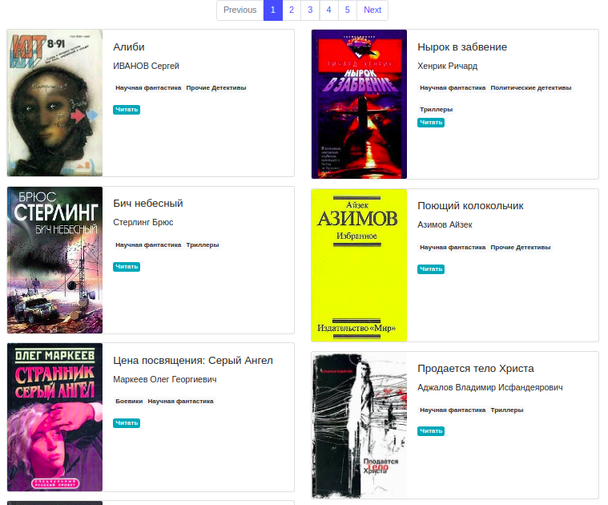

## Project "web library" site.
Web library, books information taken form json file, it was parsed from [tululu.org](tululu.org). Json file directory:
 ```layout-website-with-bootstrap/pages/dest_folder/json```
 
 

## Get started
##### Offline
- Clone repository from github.
- In directory ```pages```, click 
```index1.htlm``` file to start.

##### Online
- Clone repository, 
- install dependencies:
``` pip install -r requirements.txt```.
- Run it ``` python render_website.py``` page opened in ```http://127.0.0.1:5500/pages/index1.html```

## Deploy example.
Project deployed on "Github pages" [https://axmetes.github.io/layout-website-with-bootstrap/pages/index1.html](https://axmetes.github.io/layout-website-with-bootstrap/pages/index1.html)

## Motivation
The code is written for educational purposes - this is a lesson in Python and web development on the site [Devman](https://dvmn.org).
  